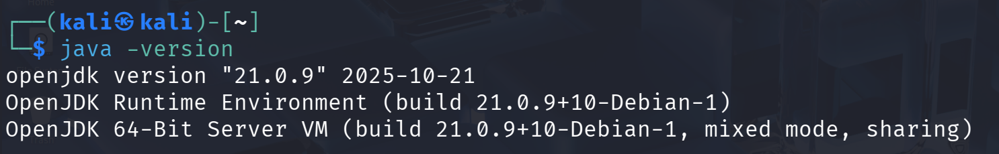
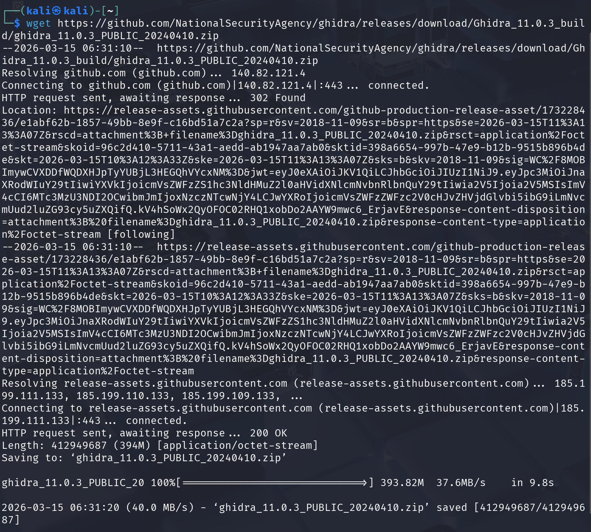
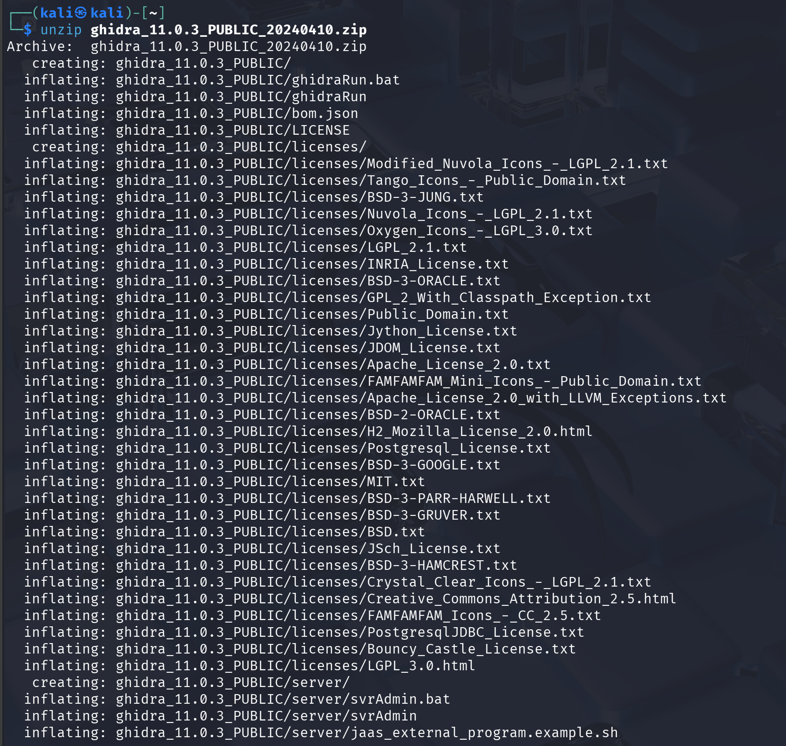
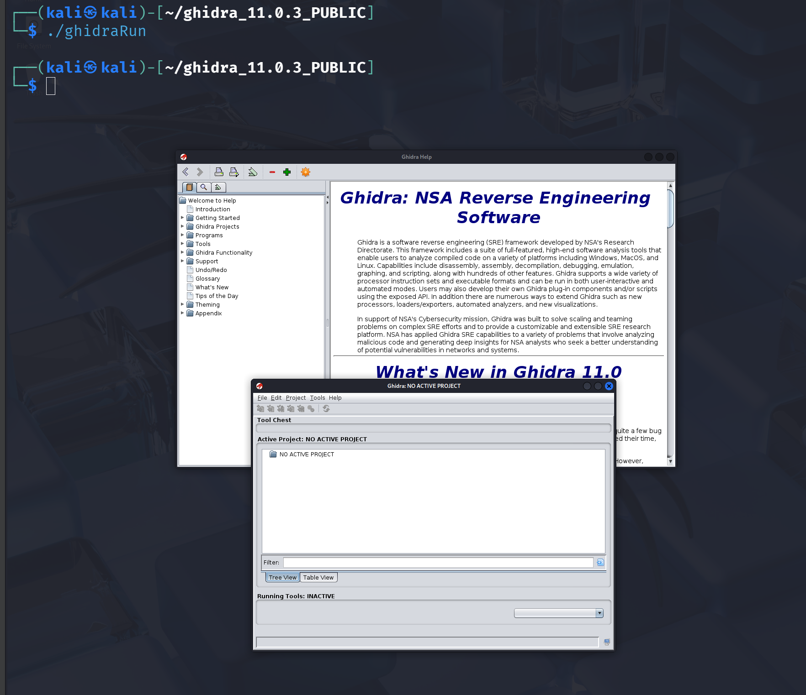

# Ghidra Installation

## Introduction

Before performing binary analysis, it is necessary to install the **Ghidra reverse engineering framework** and ensure that the required dependencies are available in the system.

Ghidra is a Java-based application, which means that a compatible **Java Development Kit (JDK)** must be installed before running the tool.

This section describes the steps followed to download, install and launch Ghidra in a Linux environment.

---

## Java Verification

Ghidra requires **JDK 17 or higher** to run correctly. The first step is to verify that Java is installed in the system.

The following command was used:

```bash
java -version
```

Example output:



The output confirms that **OpenJDK 21** is installed, which is compatible with the Ghidra framework.

---

## Downloading Ghidra

Ghidra can be downloaded from the official repository maintained by the NSA.

In this laboratory, the tool was downloaded using the following command:

```bash
wget https://github.com/NationalSecurityAgency/ghidra/releases/download/Ghidra_11.0.3_build/ghidra_11.0.3_PUBLIC_20240410.zip
```

Download process:



This command retrieves the compressed archive containing the Ghidra framework.

---

## Extracting the Files

Once the archive has been downloaded, it must be extracted.

The following command was used:

```bash
unzip ghidra_11.0.3_PUBLIC_20240410.zip
```

Extraction process:



After extraction, a directory containing the full Ghidra framework is created.

---

## Launching Ghidra

To start the application, it is necessary to enter the extracted directory and execute the launch script.

```bash
cd ghidra_11.0.3_PUBLIC
./ghidraRun
```

Ghidra startup:



If the Java environment is correctly configured, the Ghidra graphical interface will start successfully and the **Tool Chest window** will appear.

At this point, the installation process is complete and the tool is ready to be used for binary analysis.

---

## Summary

The installation process consists of four main steps:

1. Verify the Java installation
2. Download the Ghidra framework
3. Extract the compressed archive
4. Launch the application using the provided script

Once these steps are completed, the Ghidra environment is ready to perform reverse engineering and binary analysis tasks.
