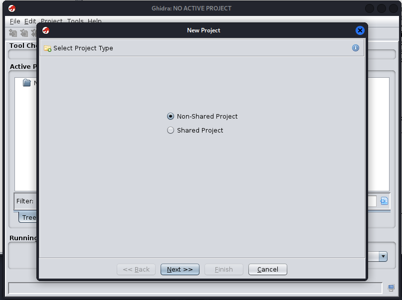
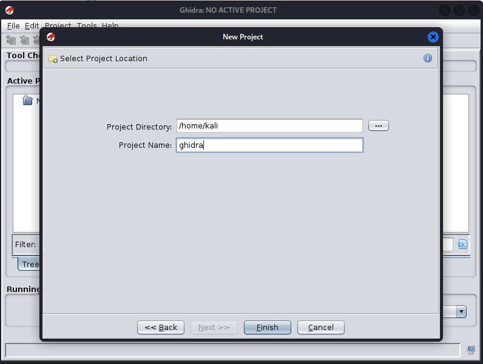
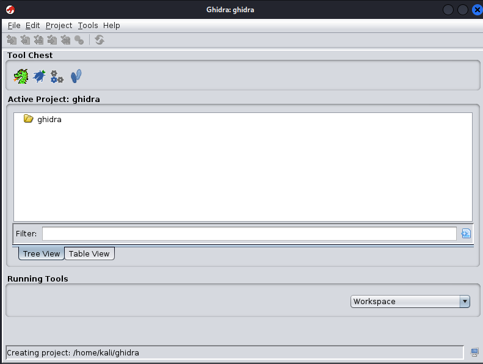

# Ghidra Project Setup

## Creating a New Project

After installing and launching Ghidra, the next step is to create a project where the binary analysis will be performed.

Ghidra organizes reverse engineering work inside **projects**, which store imported binaries, analysis results and metadata generated by the framework.

To create a new project, open the main menu and select:

```
File → New Project
```

Ghidra will display a window asking for the **project type**.



For this laboratory, the option **Non-Shared Project** was selected. This type of project is used for local analysis performed by a single user.

---

## Project Configuration

After selecting the project type, Ghidra requires the configuration of two parameters:

* **Project Directory** – location where the project will be stored
* **Project Name** – name assigned to the analysis workspace

In this example, the following configuration was used:

* Project Directory: `/home/kali`
* Project Name: `ghidra`



Once the configuration is confirmed, Ghidra creates the project workspace.

---

## Project Manager

After the project is created, the **Project Manager window** displays the newly created workspace.



This interface will be used to import binaries and manage the analysis files during the reverse engineering process.

