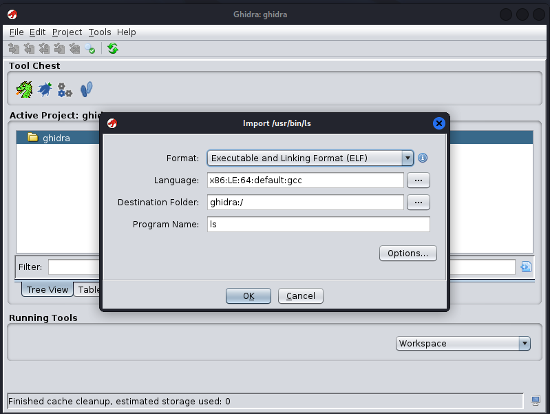
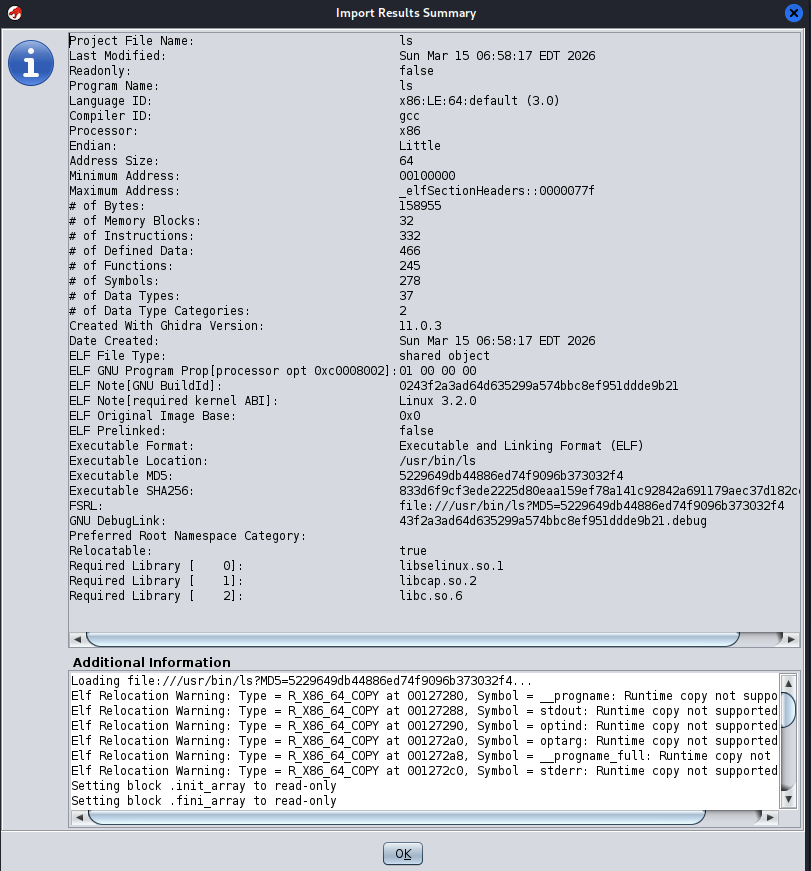
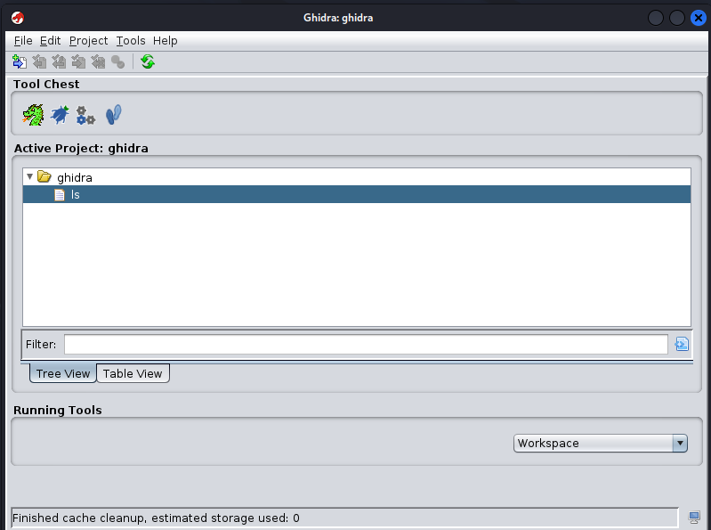

# Importing the Binary

## Selecting the Executable

Once the project has been created, the next step is to import a binary file that will be analyzed using Ghidra.

To import a program, the following option is selected from the main menu:

```
File → Import File
```

For this laboratory exercise, the Linux executable **/usr/bin/ls** was selected. This program is part of the GNU core utilities and is available on most Linux systems.



Ghidra automatically detects the executable format and architecture. In this case, the tool identifies the file as an **Executable and Linkable Format (ELF)** binary compiled for the **x86-64 architecture**.

---

## Import Results

After selecting the binary, Ghidra displays a summary of the import process. This information includes details about the executable such as processor architecture, number of instructions, memory layout and referenced libraries.



This step confirms that the binary has been successfully loaded into the project environment.

---

## Binary Added to the Project

Once the import process is complete, the executable appears inside the **Project Manager**.



The imported program can now be opened to begin the reverse engineering process.

The next step will involve running the **automatic analysis** provided by Ghidra, which will generate disassembly and decompiled code for the executable.

