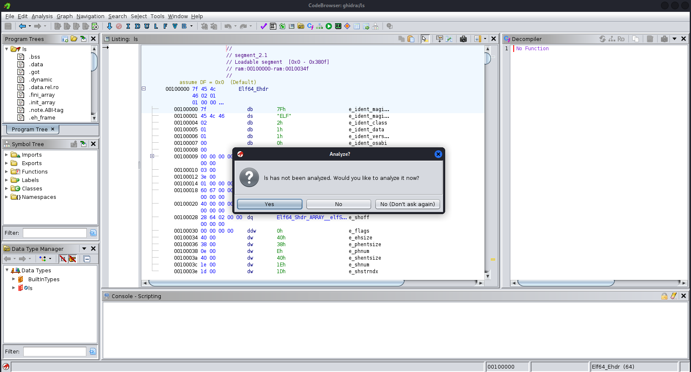
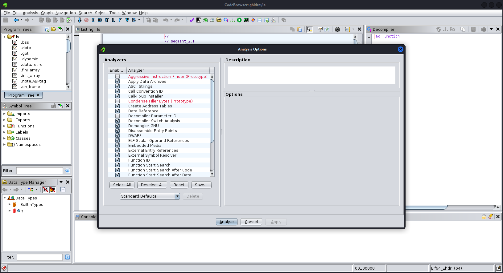
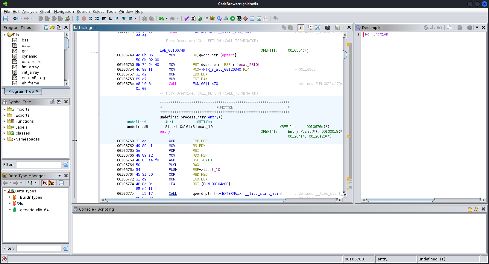

# Binary Analysis

## Opening the Program

After importing the executable into the project, the next step is to open it in order to begin the reverse engineering process.

This is done by double-clicking the program inside the **Project Manager**.

When the executable is opened for the first time, Ghidra prompts the user to perform an automatic analysis of the binary.

This step allows Ghidra to inspect the structure of the executable and identify important program components.

---

## Automatic Analysis

Ghidra includes a powerful automated analysis engine capable of identifying functions, instructions, symbols and data structures within the executable.

When the analysis is triggered, Ghidra displays the **Analysis Options** window.

For this laboratory exercise, the default analysis options were used.

Once the **Analyze** button is selected, Ghidra processes the binary and generates internal representations of the program.

---

## Disassembly View

After the analysis process is completed, the main interface displays the disassembled instructions of the executable.

The Ghidra interface provides several panels that assist the reverse engineering process:

* **Listing Window** – shows the disassembled machine code
* **Symbol Tree** – lists detected program symbols
* **Program Tree** – displays the binary sections
* **Decompiler Window** – generates pseudocode that approximates the original source code

These tools allow analysts to explore how the executable works internally and understand the logic of the program.

Ghidra automatically analyzed the imported ELF executable, identifying its architecture, program sections, functions, external library references and generating a disassembly view that allows the internal logic of the program to be inspected.
